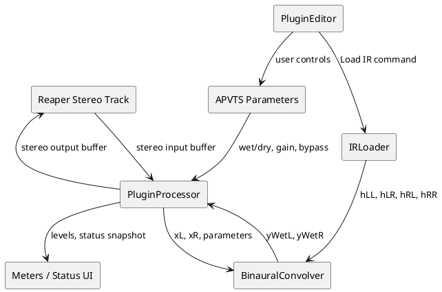
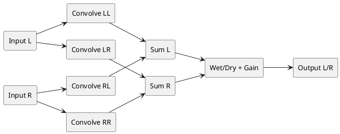

# PRD-Binaural Speaker Room Emulator VST3

## 1. Product Overview

### 1.1 Product Name

Working name: **Binaural Speaker Room Emulator**

### 1.2 Goal

Create a Windows VST3 audio effect plugin for Reaper that emulates listening to stereo loudspeakers in a room over headphones by convolving stereo input audio with a 4-channel binaural impulse response WAV.

The plugin must preserve the relative level differences between the 4 impulse-response channels so the user can compare real speaker playback loudness and headphone simulation loudness without hidden gain manipulation.

### 1.3 Target User

An audio engineer, producer, researcher, or hobbyist who wants to place this plugin on a stereo track in Reaper and monitor a binaural speaker/room simulation through headphones.

### 1.4 MVP Summary

The MVP is a single-window VST3 plugin with:

- Stereo audio input and stereo audio output.
- User-loadable 4-channel WAV impulse response.
- Fixed 4-channel routing model:
  - IR channel 1 = LL: left speaker to left ear.
  - IR channel 2 = LR: left speaker to right ear.
  - IR channel 3 = RL: right speaker to left ear.
  - IR channel 4 = RR: right speaker to right ear.
- Binaural convolution matrix:
  - Output L = Input L * LL + Input R * RL.
  - Output R = Input L * LR + Input R * RR.
- Wet/dry mix.
- Output gain.
- Bypass.
- Safe, explicit gain policy that never normalizes IR channels independently.
- Simple visual status panel showing IR load state, sample rate, channel count, IR length, routing, and gain mode.

---

## 2. Tech Stack

### 2.1 Recommended Stack

Use the following stack for the MVP:

| Area | Choice | Reason |
|---|---|---|
| Language | C++20 | Standard for native low-latency audio plugins. |
| Plugin framework | JUCE 8.x | Mature VST3 support, CMake workflow, DSP utilities, UI framework, parameter/state management. |
| Plugin format | VST3 only for MVP | Required target is Reaper on Windows. Avoid extra formats until VST3 is stable. |
| Build system | CMake | Works well with VSCode, GitHub Copilot, CI, and JUCE's current project workflow. |
| IDE | VSCode | User's chosen environment. |
| Compiler/toolchain | Visual Studio 2022 Build Tools / MSVC | Standard Windows C++ plugin build toolchain. |
| Package/dependency strategy | Git submodule or FetchContent for JUCE | Keep project reproducible. Prefer pinned JUCE version/tag. |
| Audio host for testing | Reaper | Primary compatibility target. |
| Automated plugin validation | Steinberg VST3 validator if available in local SDK/tooling | Catch VST3 contract and host-compatibility issues early. |
| Unit testing | Catch2 or JUCE UnitTestRunner | Validate DSP matrix routing, WAV validation, parameter behavior. |

### 2.2 Suggested Repository Structure

```text
binaural-speaker-room-vst3/
  CMakeLists.txt
  README.md
  LICENSE
  /JUCE/                         # submodule or fetched dependency, not copied manually unless intentional
  /Source/
    PluginProcessor.h
    PluginProcessor.cpp
    PluginEditor.h
    PluginEditor.cpp
    IRLoader.h
    IRLoader.cpp
    BinauralConvolver.h
    BinauralConvolver.cpp
    Parameters.h
    Calibration.h
    UiComponents/
      LevelMeter.h
      LevelMeter.cpp
      StatusPanel.h
      StatusPanel.cpp
  /Tests/
    CMakeLists.txt
    BinauralConvolverTests.cpp
    IRLoaderTests.cpp
    ParameterTests.cpp
  /Assets/
    test_ir_quad.wav              # optional test fixture only; do not hardcode production path
  /docs/
    routing.md
    calibration.md
```

### 2.3 Non-Goals for Tech Stack

Do not use Electron, web UI, Python runtime, Max/MSP, HISE, or a standalone-only framework for the MVP. This must be a native VST3 plugin.

---

## 3. Core Features

### 3.1 Main Features / Primary User Stories

#### M1 — Load 4-Channel Binaural IR WAV

As a user, I want to load a 4-channel WAV file containing binaural speaker-room impulse responses so that the plugin can emulate my measured speaker/room/head response.

Acceptance criteria:

- The UI contains a **Load IR** button.
- Clicking **Load IR** opens a native file chooser.
- The plugin accepts WAV files with exactly 4 channels.
- The plugin rejects non-WAV files for MVP.
- The plugin rejects WAV files with fewer or more than 4 channels.
- The plugin displays a clear error message if the file is invalid.
- The plugin displays:
  - File name.
  - Sample rate.
  - Channel count.
  - Length in samples.
  - Length in milliseconds.
- The plugin stores the selected IR path in plugin state so Reaper sessions reload correctly when the file still exists.
- If the saved IR path is missing at session reload, the plugin should enter a safe unloaded state and show a warning.

#### M2 — Correct Binaural Convolution Routing

As a user, I want the plugin to apply the 4 IR channels as a speaker-to-ear matrix so the stereo headphone output represents two speakers captured binaurally.

Required routing:

```text
IR Channel 1 = LL = left speaker -> left ear
IR Channel 2 = LR = left speaker -> right ear
IR Channel 3 = RL = right speaker -> left ear
IR Channel 4 = RR = right speaker -> right ear

Output L = convolve(Input L, LL) + convolve(Input R, RL)
Output R = convolve(Input L, LR) + convolve(Input R, RR)
```

Acceptance criteria:

- Stereo input buffers are processed as stereo.
- Stereo output buffers are produced.
- Mono track behavior is not optimized for MVP; if host gives mono input, plugin should duplicate mono to L/R or show unsupported layout depending on JUCE layout negotiation.
- The convolver must preserve inter-channel IR amplitude relationships.
- No hidden independent channel normalization is allowed.
- The dry path remains sample-aligned as closely as practical with wet path latency handling.
- Plugin reports latency to host if the convolution implementation introduces latency.

#### M3 — Gain Preservation and Calibration-Safe Behavior

As a user, I want to compare real speaker playback loudness with headphone simulation loudness, so the plugin must avoid hidden gain changes that alter the measured relationship between IR channels.

Acceptance criteria:

- Default IR gain mode: **Preserve IR Levels**.
- The plugin must not normalize LL/LR/RL/RR independently.
- The plugin must not auto-normalize the summed stereo output by default.
- If any gain safety is added, it must be explicit and user-visible.
- Add a status label: **Gain mode: Preserve IR channel relationships**.
- Add an optional global **IR Trim** or **Output Gain** only if it applies equally to the final stereo output or all IR channels together.
- Never apply per-channel loudness correction unless the user explicitly enables a future advanced mode.

#### M4 — Wet/Dry Mix

As a user, I want to blend between the original stereo signal and the binaural room simulation.

Acceptance criteria:

- Parameter name: `wetDry`.
- Range: 0% to 100%.
- Default: 100% wet.
- 0% = dry stereo input only.
- 100% = fully convolved binaural output.
- Mix should be equal-power or linear. MVP default: linear, unless changed later.
- Parameter must be automatable in Reaper.
- UI control: rotary knob or horizontal slider labeled **Wet/Dry**.

#### M5 — Output Gain

As a user, I want to trim the final output level to match perceived loudness safely without changing the IR channel relationships.

Acceptance criteria:

- Parameter name: `outputGainDb`.
- Range: -24 dB to +12 dB.
- Default: 0 dB.
- Applies equally to final stereo output after wet/dry mix.
- Must be automatable.
- UI control labeled **Output Gain**.

#### M6 — Bypass

As a user, I want to bypass the plugin quickly for A/B comparison.

Acceptance criteria:

- Parameter name: `bypass`.
- Boolean.
- Default: false.
- When enabled, output equals unprocessed input, subject only to required host bypass semantics.
- UI control labeled **Bypass**.
- Must be automatable if practical.

#### M7 — Status and Diagnostics Panel

As a user, I want to know whether the plugin is loaded correctly and whether the IR routing is what I expect.

Acceptance criteria:

The main page must display:

- Plugin state: `No IR loaded`, `IR loaded`, or `IR error`.
- IR file name.
- IR sample rate.
- Host sample rate.
- IR length in samples and milliseconds.
- Routing summary:
  - `Out L = In L × LL + In R × RL`
  - `Out R = In L × LR + In R × RR`
- Gain mode:
  - `Preserve IR channel relationships`
- Warning area for:
  - Missing file.
  - Invalid channel count.
  - Unsupported format.
  - Excessive output clipping risk.

---

### 3.2 Secondary Features

#### S1 — Basic Input/Output Level Meters

Add simple stereo level meters for input and output.

Acceptance criteria:

- Display input L/R and output L/R peak or RMS levels.
- Meters are informative only; they must not affect audio.
- Update rate should avoid UI performance issues.

#### S2 — Clip Indicator

Warn the user if output approaches or exceeds full scale.

Acceptance criteria:

- Detect output samples above -1 dBFS or 0 dBFS.
- Show a visual warning.
- Do not auto-reduce gain.
- User must manually adjust Output Gain.

#### S3 — Remember Last Loaded IR

Remember the last loaded IR path in plugin state.

Acceptance criteria:

- Reaper project save/load restores the IR path.
- If file is present, reload IR automatically.
- If missing, show warning and pass dry or silence according to safe-state policy.
- MVP safe-state policy: pass dry audio when no IR is loaded and show `No IR loaded — passing dry audio`.

#### S4 — Optional Embedded Example IR for Development Only

The uploaded 4-channel file may be used as a development fixture or default example only if licensing and user consent are clear.

Acceptance criteria:

- Do not assume the provided IR can be redistributed publicly.
- If embedded, make this explicit in the README and build config.
- For MVP product behavior, user-loadable IR is required.

---

## 4. Page & Component Structure

This plugin has one main page/window for MVP. Do not build multiple tabs or complex navigation yet.

### 4.1 Main Plugin Window

Suggested size: approximately `700 x 420 px`, resizable optional but not required for MVP.

Initial contents:

```text
+------------------------------------------------------+
| Binaural Speaker Room Emulator                       |
| Emulate stereo speakers in room over headphones      |
+------------------------------------------------------+
| [Load IR...]   File: _quad_nr3_sm.wav                |
| Status: IR loaded                                    |
| IR: 44.1 kHz, 4 ch, 11106 samples, 251.84 ms         |
| Host: 48 kHz                                         |
+------------------------------------------------------+
| Routing                                              |
| Out L = In L × LL + In R × RL                        |
| Out R = In L × LR + In R × RR                        |
| Gain mode: Preserve IR channel relationships         |
+------------------------------------------------------+
| Wet/Dry [ knob/slider ] 100%                         |
| Output Gain [ knob/slider ] 0.0 dB                   |
| [ Bypass toggle ]                                    |
+------------------------------------------------------+
| Input Meter L/R       Output Meter L/R               |
| Warning / Error area                                 |
+------------------------------------------------------+
```

### 4.2 Components

#### C1 — HeaderComponent

Displays:

- Plugin name.
- Short subtitle.
- Version number.

#### C2 — IRLoaderComponent

Contains:

- `Load IR...` button.
- Current IR file label.
- Load/error status.

Responsibilities:

- Trigger native file chooser.
- Pass selected file to processor via safe async mechanism.
- Update UI after successful/failed load.

#### C3 — IRInfoComponent / StatusPanel

Displays:

- IR sample rate.
- Host sample rate.
- Channel count.
- Length samples/ms.
- Gain mode.
- Routing summary.

#### C4 — ControlPanelComponent

Contains:

- Wet/Dry slider.
- Output Gain slider.
- Bypass toggle.

Implementation detail:

- Attach controls to `AudioProcessorValueTreeState` parameters.
- Avoid direct UI-to-DSP mutation outside parameter/state mechanisms.

#### C5 — MeterComponent

Displays:

- Input L/R level.
- Output L/R level.
- Optional clip indicator.

#### C6 — WarningBannerComponent

Displays important warnings:

- No IR loaded.
- Invalid IR file.
- Missing saved IR file.
- Output clipping.
- Unsupported channel layout.

---

## 5. User Flows

### 5.1 First Launch in Reaper

1. User inserts plugin on a stereo Reaper track.
2. Plugin opens with no IR loaded.
3. Plugin shows: `No IR loaded — passing dry audio`.
4. Wet/Dry defaults to 100%, Output Gain defaults to 0 dB, Bypass defaults to off.
5. Because no IR is loaded, plugin passes dry audio to avoid silence/confusion.
6. User clicks **Load IR...**.
7. File chooser opens.
8. User selects a 4-channel WAV.
9. Plugin validates file.
10. If valid, plugin loads IR channels into the binaural convolver.
11. Status updates to `IR loaded`.
12. Audio output becomes binaural convolved stereo.

Outcome: user hears speaker/room emulation over headphones.

### 5.2 Invalid IR Load

1. User clicks **Load IR...**.
2. User selects a mono, stereo, 5.1, or non-WAV file.
3. Plugin validates file and detects unsupported format or channel count.
4. Plugin rejects file.
5. Existing valid IR remains active if one was already loaded.
6. If no previous IR existed, plugin continues passing dry audio.
7. Warning area shows a clear message, e.g. `Invalid IR: expected 4-channel WAV, got 2 channels`.

Outcome: no crash, no silent failure, no accidental replacement with invalid data.

### 5.3 A/B Loudness Comparison

1. User loads measured 4-channel IR.
2. User plays reference audio through plugin into headphones.
3. User compares against real speaker playback.
4. User toggles **Bypass** to compare dry stereo vs simulated speaker-room response.
5. User adjusts **Output Gain** only as a global final trim.
6. Plugin does not normalize individual IR channels or alter LL/LR/RL/RR relationships.
7. Clip indicator warns if output is too hot.

Outcome: user can manually evaluate loudness match without the plugin hiding calibration changes.

### 5.4 Reopen Saved Reaper Project

1. User saves Reaper project with plugin loaded and IR selected.
2. User reopens the project later.
3. Plugin restores parameters and saved IR path.
4. If file exists, plugin reloads it.
5. If file is missing, plugin shows missing-file warning and passes dry audio.

Outcome: project is recoverable and transparent.

---

## 6. Audio Processing Method

### 6.1 Signal Model

Let:

- `xL[n]` = input left sample stream.
- `xR[n]` = input right sample stream.
- `hLL[n]` = IR channel 1.
- `hLR[n]` = IR channel 2.
- `hRL[n]` = IR channel 3.
- `hRR[n]` = IR channel 4.

Wet output:

```text
yWetL[n] = xL[n] * hLL[n] + xR[n] * hRL[n]
yWetR[n] = xL[n] * hLR[n] + xR[n] * hRR[n]
```

Final output:

```text
yOutL[n] = outputGain * ((1 - wet) * xL[n] + wet * yWetL[n])
yOutR[n] = outputGain * ((1 - wet) * xR[n] + wet * yWetR[n])
```

Where:

- `*` means convolution.
- `wet` is `wetDry / 100`.
- `outputGain = Decibels::decibelsToGain(outputGainDb)`.

### 6.2 Architecture Diagram



### 6.3 Routing Diagram



### 6.4 Convolution Implementation Notes

Preferred MVP implementation:

- Use four mono convolution processors internally, one per IR channel.
- Do not rely on a stereo convolution helper unless its channel semantics are fully controlled and tested.
- Process paths:
  - `convLL.process(inputL)`
  - `convLR.process(inputL)`
  - `convRL.process(inputR)`
  - `convRR.process(inputR)`
- Sum into temporary wet L/R buffers.
- Apply wet/dry and output gain.

Important:

- Avoid allocations in `processBlock`.
- Preallocate temporary buffers in `prepareToPlay`.
- Load or swap IRs using a thread-safe mechanism outside the real-time audio thread.
- If IR reload causes expensive work, perform file reading/preparation off the audio thread and atomically swap ready convolution engines or use JUCE-supported thread-safe convolution loading.

### 6.5 Uploaded Example IR Metadata for Testing

The provided example file `_quad_nr3_sm.wav` has:

- 4 channels.
- 44,100 Hz sample rate.
- 11,106 samples.
- Approximate duration: 251.84 ms.
- Floating-point audio data.

Measured per-channel levels from the uploaded file:

| Channel | Meaning | RMS dBFS approx | Peak dBFS approx |
|---|---|---:|---:|
| 1 | LL | -49.08 dBFS | -14.78 dBFS |
| 2 | LR | -59.89 dBFS | -31.79 dBFS |
| 3 | RL | -60.86 dBFS | -31.55 dBFS |
| 4 | RR | -48.64 dBFS | -15.56 dBFS |

This confirms that channel levels are intentionally different and must not be independently normalized.

---

## 7. Parameters and State

### 7.1 Parameters

| ID | Name | Type | Range | Default | Automatable |
|---|---|---|---|---|---|
| `wetDry` | Wet/Dry | Float | 0–100% | 100% | Yes |
| `outputGainDb` | Output Gain | Float | -24 to +12 dB | 0 dB | Yes |
| `bypass` | Bypass | Bool | off/on | off | Yes, if practical |

### 7.2 Non-Automated State

Store these in plugin state but do not expose as automatable audio parameters:

| Key | Type | Purpose |
|---|---|---|
| `irFilePath` | String | Path to selected IR file. |
| `irFileName` | String | Display only. |
| `irSampleRate` | Double | Display and validation. |
| `irLengthSamples` | Integer | Display. |
| `irLastError` | String | Restore/display warning if load fails. |

### 7.3 State Save/Load Rules

- Save all parameters through `AudioProcessorValueTreeState`.
- Save IR path as extra ValueTree property or APVTS state property.
- On state restore:
  - Restore parameter values immediately.
  - Attempt to reload IR from saved path.
  - If reload fails, show warning and pass dry audio.
- Do not block the audio thread during state restore.

---

## 8. Implementation Phases

## Phase 1 — Project Skeleton and Main Page Only

### Goal

Create a working JUCE VST3 project that builds in VSCode/CMake on Windows and opens in Reaper with a functional main page UI. Audio processing may pass dry audio initially.

### Scope

Build only:

- JUCE CMake project.
- VST3 target.
- `PluginProcessor`.
- `PluginEditor`.
- Main page layout.
- APVTS parameters for wet/dry, output gain, bypass.
- Placeholder status panel.
- Dry pass-through processing.

### First Sprint Requirements

Copilot/developer should implement:

1. `CMakeLists.txt` configured for a JUCE VST3 plugin.
2. Minimal `PluginProcessor` with stereo bus layout support.
3. Minimal `PluginEditor` with:
   - Header.
   - Load IR button, not functional yet or stubbed.
   - Wet/Dry slider.
   - Output Gain slider.
   - Bypass toggle.
   - Status panel showing `No IR loaded — passing dry audio`.
4. APVTS parameter layout.
5. State save/load for the three parameters.
6. Reaper smoke test instructions in README.

### Constraints

- Do not implement convolution yet.
- Do not implement IR file parsing yet except optional stub.
- Do not add multiple pages, tabs, presets, installers, or advanced calibration modes.
- Do not add automatic normalization.
- Focus only on the main plugin page and stable build/run loop.

### Phase 1 Testing

Required tests/checks:

- Project configures with CMake on Windows.
- Project builds VST3 successfully.
- Plugin is discoverable by Reaper.
- Plugin opens without crashing.
- Stereo audio passes through unchanged when no IR is loaded.
- Wet/Dry, Output Gain, and Bypass controls render and update parameter values.
- Reaper project save/load restores parameter values.

---

## Phase 2 — IR Loading and Validation

### Goal

Allow user to load a 4-channel WAV and display metadata safely.

### Scope

Implement:

- Native file chooser.
- WAV parsing via JUCE audio format readers.
- Validation for exactly 4 channels.
- Metadata extraction.
- IR path persistence.
- Error handling.

### Constraints

- Do not convolve audio yet unless Phase 2 is stable.
- Do not normalize or trim IR audio.
- Do not silently accept unsupported channel counts.

### Testing

- Load valid 4-channel WAV.
- Reject mono WAV.
- Reject stereo WAV.
- Reject missing file after session reload.
- Confirm previous valid IR remains active after invalid load attempt.

---

## Phase 3 — Binaural Convolution DSP

### Goal

Implement the core 4-channel binaural convolution matrix.

### Scope

Implement:

- `BinauralConvolver` class.
- Four internal convolution paths.
- Temporary wet buffers.
- Correct LL/LR/RL/RR routing.
- Wet/dry mix.
- Output gain.
- Bypass handling.
- Latency reporting if applicable.

### Constraints

- No heap allocation in `processBlock`.
- No file I/O in `processBlock`.
- No independent channel normalization.
- No automatic clipping limiter.

### Testing

Unit tests:

- Impulse input through LL-only test IR produces signal only at output L.
- Impulse input through LR-only test IR produces signal only at output R from input L.
- Impulse input through RL-only test IR produces signal only at output L from input R.
- Impulse input through RR-only test IR produces signal only at output R from input R.
- Wet/Dry 0% equals dry input.
- Wet/Dry 100% equals wet output.
- Output Gain applies equally to both output channels.
- Bypass equals dry input.

Manual tests:

- Load provided `_quad_nr3_sm.wav`.
- Confirm audible binaural speaker-room effect on headphones.
- Compare output level and clipping behavior.

---

## Phase 4 — Diagnostics, Meters, and Reaper Hardening

### Goal

Improve confidence and usability inside Reaper.

### Scope

Implement:

- Input/output meters.
- Clip warning.
- Better error banner.
- Host sample-rate display.
- Reaper session reload tests.
- Performance profiling.

### Constraints

- Meters must not affect audio.
- Clip warning must not auto-gain or limit.
- Keep single-page UI.

### Testing

- Reaper playback with different buffer sizes.
- Reaper sample rates: 44.1 kHz, 48 kHz, 96 kHz if feasible.
- Plugin reload after project close/open.
- Rapid bypass toggling.
- Rapid wet/dry automation.
- Load IR while audio is playing.

---

## Phase 5 — Packaging and Documentation

### Goal

Make the plugin easy to build, install, and test on another Windows machine.

### Scope

Implement:

- README build instructions.
- Reaper install path notes.
- Troubleshooting section.
- Optional GitHub Actions build.
- Version tagging.

### Constraints

- Do not add macOS/Linux support unless specifically requested.
- Do not add AU/AAX/LV2 formats yet.
- Do not redistribute the uploaded IR without explicit permission.

---

## 9. Testing Requirements

### 9.1 Unit Tests

Required:

- `IRLoaderTests`
  - Valid 4-channel WAV accepted.
  - Invalid channel count rejected.
  - Metadata calculated correctly.
- `BinauralConvolverTests`
  - Matrix routing correctness.
  - Gain preservation.
  - Wet/dry behavior.
  - Output gain behavior.
  - Bypass behavior.
- `ParameterTests`
  - Parameter defaults.
  - Parameter ranges.
  - State save/load.

### 9.2 Integration Tests

Required:

- Build VST3.
- Load in Reaper.
- Insert on stereo track.
- Load valid IR.
- Save Reaper session.
- Reopen Reaper session.
- Verify IR reload or warning.

### 9.3 Regression Tests

Run after every DSP change:

- No crash when no IR loaded.
- No crash when invalid IR selected.
- No hidden normalization introduced.
- Stereo in/stereo out layout remains available.
- Wet/dry and bypass still work.

### 9.4 UX Checks

Required:

- Main UI fits on common laptop displays.
- Text is readable on Windows scaling settings.
- Controls have labels and units.
- Error messages are specific.
- User can understand the active routing without reading source code.

---

## 10. Out-of-Scope and Edge Case Notes

### 10.1 Out of Scope for MVP

Do not implement without explicit approval:

- Multiband processing.
- Head tracking.
- Personalized HRTF editing.
- Room correction EQ.
- Automatic loudness matching.
- Independent channel normalization.
- Per-ear gain compensation.
- IR trimming or silence removal.
- IR phase manipulation.
- Preset browser.
- Cloud sync.
- Standalone app.
- macOS/Linux builds.
- AU/AAX/LV2 formats.
- Installer.

### 10.2 Pause and Ask Before Implementing

Pause and ask for clarification if any implementation would require:

- Changing the IR channel order.
- Applying normalization, limiting, compression, or loudness matching.
- Summing or downmixing the 4 IR channels before convolution.
- Altering relative LL/LR/RL/RR levels.
- Loading non-WAV formats.
- Supporting surround input/output.
- Embedding or redistributing the uploaded IR.
- Changing default behavior when no IR is loaded.
- Adding automatic gain compensation.

### 10.3 Edge Case Handling

| Edge Case | Required Behavior |
|---|---|
| No IR loaded | Pass dry audio and show warning. |
| Invalid IR selected | Reject file; keep previous valid IR if available. |
| Missing saved IR path | Pass dry audio and show missing-file warning. |
| Host provides non-stereo layout | Prefer stereo-only layout; otherwise show unsupported layout warning. |
| IR sample rate differs from host | Resample IR during load or rely on JUCE convolution resampling, but show both rates. |
| Output clips | Show warning; do not auto-reduce gain. |
| User loads IR during playback | Avoid audio-thread blocking; transition should not crash. |
| Very long IR | MVP may reject with clear message or load if performance acceptable. Suggested soft warning above 5 seconds. |

---

## 11. Additional Guidance for GitHub Copilot

### 11.1 Development Rules

- Make small, modular commits.
- Keep DSP code separate from UI code.
- Keep file loading separate from real-time audio processing.
- Avoid large generated rewrites of existing files.
- Prefer adding focused classes over expanding `PluginProcessor` into a monolith.
- Never allocate memory, read files, show dialogs, or lock long mutexes inside `processBlock`.
- Never add hidden normalization or auto-gain.
- Write tests before refactoring the routing matrix.

### 11.2 Suggested Class Responsibilities

#### `IRLoader`

Responsibilities:

- Open/read WAV file.
- Validate 4 channels.
- Extract metadata.
- Return deinterleaved channel buffers.
- Report errors.

Must not:

- Apply per-channel normalization.
- Decide final DSP routing.
- Perform UI work.

#### `BinauralConvolver`

Responsibilities:

- Own convolution engines.
- Load four IR channel buffers.
- Process stereo input into stereo wet output.
- Preserve relative IR levels.

Must not:

- Open files.
- Own UI controls.
- Apply unrelated effects.

#### `PluginProcessor`

Responsibilities:

- Own APVTS.
- Own `BinauralConvolver`.
- Implement `prepareToPlay`, `processBlock`, and state save/load.
- Handle dry pass-through safe state.

#### `PluginEditor`

Responsibilities:

- Build single-page UI.
- Attach controls to APVTS.
- Trigger IR file selection.
- Display status and warnings.

### 11.3 First Copilot Prompt to Start Implementation

Use this as the first implementation prompt in VSCode Copilot Chat:

```text
Create the initial JUCE 8 CMake VST3 plugin skeleton for a Windows/Reaper plugin called "BinauralSpeakerRoom". Use C++20. Implement only Phase 1 from the PRD: stereo dry pass-through, APVTS parameters wetDry, outputGainDb, and bypass, and a single PluginEditor page with Load IR button placeholder, status panel, Wet/Dry slider, Output Gain slider, and Bypass toggle. Do not implement convolution or IR loading yet. Do not add normalization. Keep DSP, UI, and parameter definitions modular.
```

### 11.4 Second Copilot Prompt

```text
Implement IRLoader for the BinauralSpeakerRoom JUCE plugin. It should load WAV files only, validate exactly 4 channels, read floating-point sample data into four separate buffers without normalization, and return metadata including sample rate, channel count, length in samples, and duration in milliseconds. Add unit tests for valid 4-channel WAV, invalid stereo WAV, invalid missing file, and metadata reporting. Do not connect convolution yet.
```

### 11.5 Third Copilot Prompt

```text
Implement BinauralConvolver using four mono convolution paths. The routing must be: Out L = In L convolved with LL plus In R convolved with RL; Out R = In L convolved with LR plus In R convolved with RR. Preserve the relative gain of all IR channels. Add wet/dry mix, outputGainDb, and bypass in PluginProcessor. Add unit tests using synthetic impulse responses to prove LL, LR, RL, and RR routing is correct. Do not add automatic normalization, limiting, or loudness matching.
```

---

## 12. Success Metrics

The MVP is successful when:

- The plugin builds as a VST3 on Windows.
- Reaper detects and loads it.
- It can be inserted on a stereo track.
- It loads the provided 4-channel WAV.
- It produces stereo binaural output using the confirmed routing matrix.
- It preserves relative IR channel levels.
- It allows manual wet/dry, bypass, and output gain control.
- It does not crash on missing/invalid IR files.
- It saves and restores state in a Reaper project.
- A contractor can implement the MVP directly from this document.

---

## 13. Future Enhancements

Only after MVP is stable, consider:

- Preset manager.
- A/B IR slots.
- Advanced global calibration workflow.
- Optional equal-power wet/dry mode.
- Optional global IR trim applied equally to all channels.
- Optional IR time alignment tools with explicit warnings.
- Optional export/import settings.
- Optional standalone build.
- macOS support.

Do not add these during MVP unless explicitly requested.

