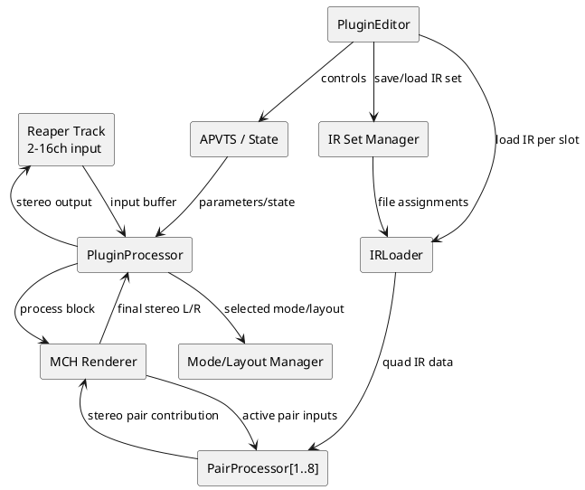

# PRD-MCH-Binaural Speaker Room Renderer VST3

## 1. Product Overview

### 1.1 Product Name

Working name: **Binaural Speaker Room Renderer — Multichannel Extension**

### 1.2 Background

The existing stereo VST3 plugin is implemented and working. It accepts stereo input, loads one 4-channel quad IR WAV, and renders stereo binaural headphone output using this confirmed routing:

```text
IR ch 1 = LL = pair A / left speaker  -> left ear
IR ch 2 = LR = pair A / left speaker  -> right ear
IR ch 3 = RL = pair B / right speaker -> left ear
IR ch 4 = RR = pair B / right speaker -> right ear

Out L = In A × LL + In B × RL
Out R = In A × LR + In B × RR
```

The next version expands this concept to multichannel source material up to **9.1.6**. The plugin remains a headphone renderer: it accepts multichannel input from a single Reaper track and outputs fixed stereo binaural audio.

Each speaker pair is emulated by one quad IR WAV. Multiple quads can be loaded into named pair slots. All active loaded pairs are processed and summed into the final stereo headphone output.

### 1.3 Goal

Create a multichannel-to-stereo binaural VST3 renderer that can be inserted on a single Reaper track containing up to 16-channel audio and render that track to stereo headphones using multiple loaded quad IRs.

### 1.4 Primary Use Case

The user has a Reaper track containing multichannel audio, for example 5.1, 7.1.4, or 9.1.6. The user inserts the plugin on that track, selects the source layout preset, loads one quad IR per speaker pair, then monitors the resulting binaural render through headphones.

Example for 9.1.6:

```text
Single Reaper track with 16-channel audio
        ↓
Plugin receives 16 input streams
        ↓
8 speaker-pair quad IR processors
        ↓
Summed stereo binaural headphone output
```

### 1.5 Key Product Rule

The plugin must preserve relative IR gain relationships. It must never independently normalize channels within a quad or normalize different pair IRs against each other.

---

## 2. Tech Stack

Use the same stack as the implemented stereo plugin unless there is a strong reason to change:

| Area | Choice | Notes |
|---|---|---|
| Language | C++20 | Continue current implementation style. |
| Framework | JUCE 8.x | Keep JUCE for VST3, UI, state, bus layouts, file loading, and DSP. |
| Plugin format | VST3 | Reaper on Windows remains the primary target. |
| IDE | VSCode | User's environment. |
| Build system | CMake | Preserve existing project workflow. |
| Host target | Reaper | Primary validation host. |
| Output format | Stereo only | Plugin is a headphone renderer. |
| Max input | 16 channels | Supports up to 9.1.6. |

Implementation note: JUCE's `AudioProcessor` bus layout support should be used to accept named/discrete multichannel input layouts and fixed stereo output. JUCE's `dsp::Convolution` supports zero-latency uniform partitioned convolution by default, plus fixed-latency and non-uniform partitioned modes for higher CPU loads or longer IRs.

---

## 3. Requirements

## 3.1 Must Have

### M1 — Stereo and Multichannel Modes in One Plugin Binary

The plugin must include both:

```text
Mode: Stereo
Mode: Multichannel Renderer
```

Stereo mode must preserve the behavior of the existing implemented plugin as closely as possible.

Multichannel Renderer mode enables:

- Layout selector.
- Multiple pair slots.
- One quad IR per active pair slot.
- Multichannel input to stereo binaural output.

Acceptance criteria:

- Existing stereo workflow remains usable.
- User can switch to MCH mode from the UI.
- Switching modes must not crash, leak resources, or corrupt saved state.
- State restore must remember selected mode.

---

### M2 — Fixed Stereo Output

The plugin must always output stereo audio.

Acceptance criteria:

- Main output bus is stereo.
- In MCH mode, input may be stereo through 16 channels depending on layout.
- The plugin is not a multichannel-output processor.
- The UI clearly states: `Output: Stereo binaural headphones`.

---

### M3 — Named Input Layout Presets

The plugin must support named layout presets instead of arbitrary custom mapping for MVP.

Required presets:

```text
Stereo
5.1
7.1
7.1.2
7.1.4
9.1.4
9.1.6
```

Acceptance criteria:

- User selects one layout from a dropdown or segmented control.
- UI shows the exact assumed input channel order.
- Only pair slots required by the selected layout are shown.
- Unused pair slots are hidden, not shown disabled.
- No custom channel remapping in MVP.

---

### M4 — Fixed Channel Order Per Preset

For 9.1.6, the assumed channel order is:

| Input Index | Channel |
|---:|---|
| 1 | L |
| 2 | R |
| 3 | C |
| 4 | LFE |
| 5 | Ls |
| 6 | Rs |
| 7 | Lrs |
| 8 | Rrs |
| 9 | Lw |
| 10 | Rw |
| 11 | Tfl |
| 12 | Tfr |
| 13 | Tml |
| 14 | Tmr |
| 15 | Trl |
| 16 | Trr |

Pair slots for 9.1.6:

| Slot | Pair | Inputs |
|---:|---|---|
| 1 | L / R | 1 / 2 |
| 2 | C / LFE | 3 / 4 |
| 3 | Ls / Rs | 5 / 6 |
| 4 | Lrs / Rrs | 7 / 8 |
| 5 | Lw / Rw | 9 / 10 |
| 6 | Tfl / Tfr | 11 / 12 |
| 7 | Tml / Tmr | 13 / 14 |
| 8 | Trl / Trr | 15 / 16 |

Acceptance criteria:

- The UI displays pair name and input channel numbers for every visible pair slot.
- The user can tell exactly which source channels feed each quad IR.
- If Reaper routing differs, the plugin does not guess; the user must correct routing in Reaper.

---

### M5 — Quad IR Per Pair Slot

Each active pair slot must load one 4-channel WAV quad IR.

Quad convention persists for every pair:

```text
IR ch 1 = pair channel A -> left ear
IR ch 2 = pair channel A -> right ear
IR ch 3 = pair channel B -> left ear
IR ch 4 = pair channel B -> right ear
```

Example for `C / LFE`:

```text
IR ch 1 = Center -> left ear
IR ch 2 = Center -> right ear
IR ch 3 = LFE    -> left ear
IR ch 4 = LFE    -> right ear
```

Acceptance criteria:

- Every active slot has a Load/Replace IR button.
- Only 4-channel WAV files are valid.
- Different slots may use different IR lengths.
- Different slots may use different source sample rates, but IRs must be resampled internally to host sample rate if needed.
- Relative levels inside each IR and across all loaded IRs must be preserved.

---

### M6 — MCH Convolution Matrix

For each active loaded pair slot:

```text
pair A input = selected input channel A
pair B input = selected input channel B

pairWetL = A × LL + B × RL
pairWetR = A × LR + B × RR
```

All active pair outputs are summed:

```text
finalWetL = sum(pairWetL for all audible pair slots)
finalWetR = sum(pairWetR for all audible pair slots)
```

Acceptance criteria:

- Each pair is processed independently.
- Loaded active pairs contribute to stereo output.
- Missing active pairs contribute silence.
- Pair routing is tested with synthetic impulse responses.
- No hidden normalization, limiting, or loudness matching is applied.

---

### M7 — Per-Pair Controls

Each visible pair slot must include:

```text
Enable
Mute
Solo
Load / Replace IR
Gain Trim
Pan
Pair Wet/Dry
Status
```

Acceptance criteria:

- Enable disables processing and CPU usage where practical.
- Mute silences pair contribution but may keep resources loaded.
- Solo is additive mixer-style solo.
- Gain Trim applies equally to the pair's final stereo contribution after convolution/dry blend.
- Pan is pre-convolution input balance within the pair.
- Pair Wet/Dry controls dry/direct vs convolved output for that pair.
- Status shows Loaded, Missing, Invalid, Disabled, or Error.

---

### M8 — Pre-Convolution Pair Pan

Pair pan must act on the input pair before convolution.

For a normal A/B pair:

```text
Pan hard A:
  A input feeds its IR paths
  B input is muted before convolution

Pan center:
  A and B feed normally

Pan hard B:
  B input feeds its IR paths
  A input is muted before convolution
```

Example for L/R pair:

```text
Pan hard L:
  only front L speaker is emulated on headphones

Pan hard R:
  only front R speaker is emulated on headphones
```

For C/LFE:

```text
Pan hard C:
  only Center is auditioned

Pan hard LFE:
  only LFE is auditioned
```

Acceptance criteria:

- Pan is pre-convolution, not post-convolution stereo balance.
- Pan does not alter the quad IR data.
- Pan is clearly labeled per pair, e.g. `L ↔ R`, `C ↔ LFE`, `Ls ↔ Rs`.

---

### M9 — Pair and Global Wet/Dry

The plugin must provide both:

```text
Global Wet/Dry
Pair Wet/Dry per slot
```

Effective wet amount:

```text
effectivePairWet = pairWet * globalWet
```

Where both values are normalized 0.0 to 1.0.

Acceptance criteria:

- `globalWet = 0%` makes all active pairs direct/dry.
- `globalWet = 100%` lets each pair use its own Pair Wet/Dry value.
- `pairWet = 0%` makes that pair direct/dry regardless of global setting.
- `pairWet = 100%` makes that pair fully controlled by global wet.
- Parameters are automatable if practical.

---

### M10 — Pair Dry Routing

For normal left/right-style pairs:

```text
Dry A -> Output L
Dry B -> Output R
```

Examples:

```text
L/R:       L   -> out L, R   -> out R
Ls/Rs:     Ls  -> out L, Rs  -> out R
Lrs/Rrs:   Lrs -> out L, Rrs -> out R
Tfl/Tfr:   Tfl -> out L, Tfr -> out R
```

For `C / LFE` only:

```text
Dry C   -> Output L + Output R equally
Dry LFE -> Output L + Output R equally
```

Acceptance criteria:

- C/LFE dry routing is explicitly special-cased.
- UI should note: `C/LFE dry routes equally to L/R`.
- Dry routing is for monitoring/debugging; virtualized output remains the primary product behavior.

---

### M11 — Missing IR Behavior

If an active layout slot has no IR loaded:

```text
That slot contributes silence.
The plugin continues processing other loaded slots.
A global warning is shown.
```

Acceptance criteria:

- Missing slots do not dry-pass by default in MCH wet processing.
- User can test partial systems without loading all IRs.
- Global warning: `Active layout has missing IRs`.
- Each missing slot shows `Missing IR`.

---

### M12 — IR Set Save / Load

The plugin should support saving and loading an IR Set as a late-phase feature.

An IR Set stores:

```text
selected mode
selected layout
slot-to-file assignments
slot enable states
slot mute states
slot solo states
slot gain trims
slot pan values
slot wet/dry values
global wet/dry
global output gain
```

Acceptance criteria:

- This is included after basic MCH processing works.
- IR Set loading must not block the audio thread.
- Missing files in an IR Set should produce per-slot warnings.
- IR Set files should be human-readable if practical, e.g. JSON.
- Reaper project state remains the primary state mechanism; IR Sets are user presets/exportable configurations.

---

### M13 — DSP Cost Awareness and Performance Budgeting

Copilot and implementers must continuously account for DSP cost.

Worst-case 9.1.6 processing requires 8 pair slots. Each pair uses 4 convolution paths:

```text
8 pairs × 4 mono convolvers = 32 mono convolution paths
```

This is much more expensive than the stereo plugin:

```text
1 pair × 4 mono convolvers = 4 mono convolution paths
```

Acceptance criteria:

- Only active, enabled, loaded, audible pairs should process where practical.
- Muted pairs should avoid unnecessary processing unless needed for smooth state transitions.
- If solo is active, non-soloed pairs should avoid convolution processing where practical.
- Missing IR slots must not process.
- Disabled slots must not process.
- Temporary buffers must be preallocated.
- No heap allocation in `processBlock`.
- No file I/O in `processBlock`.
- No long locks in `processBlock`.
- IR loading/resampling/preparation must happen off the real-time audio path, with safe swapping.
- The UI should expose approximate active DSP load, e.g. `Active pairs: 6 / 8`, `Convolution paths: 24 / 32`.

---

## 4. Should Have

### S1 — Per-Pair Level Meters

Each pair slot should show compact input and contribution meters.

Suggested minimum:

```text
Input A/B activity
Pair output L/R activity
Clip indicator per pair
```

Meters must not affect audio.

### S2 — Global Output Gain

A global final stereo output gain remains required.

Suggested range:

```text
-24 dB to +12 dB
Default: 0 dB
```

Applies equally to final stereo output after all pair summing.

### S3 — Global Bypass

Bypass should output direct monitoring signal rather than silence.

Suggested MCH bypass behavior:

- For normal pairs, direct A/B pair dry routing is summed to stereo.
- For C/LFE, C and LFE route equally to stereo.
- This behaves like `globalWet = 0%`, while preserving gain/pair enable/mute/solo logic where practical.

### S4 — Warnings and Diagnostics

Warnings should include:

- Active layout has missing IRs.
- Invalid IR channel count.
- IR file missing on session reload.
- Output clipping risk.
- Host input channel count does not match selected preset.
- CPU load risk / too many active long IRs.

---

## 5. Could Have

### C1 — Custom Channel Mapping

Not MVP. Future version may allow user-defined channel-to-slot mapping.

### C2 — Custom Pair Labels

Not MVP. Future version may allow user-renamed pair slots.

### C3 — Pair Polarity Invert

Not MVP unless a measurement workflow proves it is needed.

### C4 — Advanced Calibration Tools

Future tools may include SPL target notes, calibration offsets, and A/B measurement helpers. These must never alter IR gain relationships without explicit user action.

---

## 6. Won't Have in MVP

Do not implement in the MCH MVP:

- Automatic loudness matching.
- Independent IR channel normalization.
- Inter-slot normalization.
- Auto-limiting.
- Surround output.
- Head tracking.
- HRTF personalization editor.
- Arbitrary ambisonics decoding.
- Custom channel mapping.
- Multiple output buses.
- Installer.
- macOS/Linux support unless explicitly requested.

---

## 7. Layout Presets

### 7.1 Stereo

| Slot | Pair | Inputs |
|---:|---|---|
| 1 | L / R | 1 / 2 |

### 7.2 5.1

| Slot | Pair | Inputs |
|---:|---|---|
| 1 | L / R | 1 / 2 |
| 2 | C / LFE | 3 / 4 |
| 3 | Ls / Rs | 5 / 6 |

### 7.3 7.1

| Slot | Pair | Inputs |
|---:|---|---|
| 1 | L / R | 1 / 2 |
| 2 | C / LFE | 3 / 4 |
| 3 | Ls / Rs | 5 / 6 |
| 4 | Lrs / Rrs | 7 / 8 |

### 7.4 7.1.2

| Slot | Pair | Inputs |
|---:|---|---|
| 1 | L / R | 1 / 2 |
| 2 | C / LFE | 3 / 4 |
| 3 | Ls / Rs | 5 / 6 |
| 4 | Lrs / Rrs | 7 / 8 |
| 5 | Tfl / Tfr | 9 / 10 |

### 7.5 7.1.4

| Slot | Pair | Inputs |
|---:|---|---|
| 1 | L / R | 1 / 2 |
| 2 | C / LFE | 3 / 4 |
| 3 | Ls / Rs | 5 / 6 |
| 4 | Lrs / Rrs | 7 / 8 |
| 5 | Tfl / Tfr | 9 / 10 |
| 6 | Trl / Trr | 11 / 12 |

### 7.6 9.1.4

| Slot | Pair | Inputs |
|---:|---|---|
| 1 | L / R | 1 / 2 |
| 2 | C / LFE | 3 / 4 |
| 3 | Ls / Rs | 5 / 6 |
| 4 | Lrs / Rrs | 7 / 8 |
| 5 | Lw / Rw | 9 / 10 |
| 6 | Tfl / Tfr | 11 / 12 |
| 7 | Trl / Trr | 13 / 14 |

### 7.7 9.1.6

| Slot | Pair | Inputs |
|---:|---|---|
| 1 | L / R | 1 / 2 |
| 2 | C / LFE | 3 / 4 |
| 3 | Ls / Rs | 5 / 6 |
| 4 | Lrs / Rrs | 7 / 8 |
| 5 | Lw / Rw | 9 / 10 |
| 6 | Tfl / Tfr | 11 / 12 |
| 7 | Tml / Tmr | 13 / 14 |
| 8 | Trl / Trr | 15 / 16 |

---

## 8. Page and Component Structure

### 8.1 Main MCH Page

No extra unused slots should be shown. The selected layout determines visible pair slots.

Suggested structure:

```text
+----------------------------------------------------------+
| Binaural Speaker Room Renderer                           |
| Mode: [Stereo | Multichannel Renderer]                   |
| Input Layout: [9.1.6 ▼]    Output: Stereo headphones      |
| Host Input Channels: 16     Active Pairs: 8 / 8           |
| Convolution Paths: 32 active max                          |
+----------------------------------------------------------+
| Global Controls                                          |
| Global Wet/Dry | Output Gain | Bypass | Load IR Set       |
| Save IR Set                                             |
+----------------------------------------------------------+
| Channel Map                                              |
| 1 L, 2 R, 3 C, 4 LFE, ... 16 Trr                         |
+----------------------------------------------------------+
| Pair Slot 1: L/R    Inputs 1/2                           |
| [Load IR] file.wav  Loaded                               |
| Enable Mute Solo | Gain | Pan L↔R | Wet/Dry | Meters      |
+----------------------------------------------------------+
| Pair Slot 2: C/LFE  Inputs 3/4                           |
| [Load IR] center_lfe.wav Loaded                          |
| Enable Mute Solo | Gain | Pan C↔LFE | Wet/Dry | Meters    |
+----------------------------------------------------------+
| ... only slots for selected layout ...                   |
+----------------------------------------------------------+
| Warnings / Errors                                        |
+----------------------------------------------------------+
```

### 8.2 Components

#### ModeSelectorComponent

- Switches Stereo / Multichannel Renderer mode.
- Must not destroy existing saved state unexpectedly.

#### LayoutSelectorComponent

- Dropdown for supported presets.
- Updates visible pair slots.
- Shows expected input channel count.

#### ChannelMapComponent

- Displays exact input index to channel-name mapping.
- Must be readable without opening documentation.

#### PairSlotComponent

One reusable component per visible pair.

Contains:

- Pair name.
- Input channel indices.
- Load/Replace IR button.
- File/status label.
- Enable toggle.
- Mute toggle.
- Solo toggle.
- Gain trim.
- Pre-convolution pair pan.
- Pair wet/dry.
- Compact meters/warnings.

#### GlobalControlComponent

Contains:

- Global Wet/Dry.
- Global Output Gain.
- Global Bypass.
- Save IR Set.
- Load IR Set.
- Active pair/path count indicator.

#### WarningPanelComponent

Displays global warnings.

---

## 9. DSP Method

### 9.1 Pair Processing

For each visible/active pair slot `p`:

```text
Araw = input[channelA]
Braw = input[channelB]
```

Apply pre-convolution pair pan:

```text
Apan = Araw * panGainA
Bpan = Braw * panGainB
```

Convolve:

```text
wetL = convolve(Apan, hA_Lear) + convolve(Bpan, hB_Lear)
wetR = convolve(Apan, hA_Rear) + convolve(Bpan, hB_Rear)
```

Using quad channel naming:

```text
wetL = convolve(Apan, IR1) + convolve(Bpan, IR3)
wetR = convolve(Apan, IR2) + convolve(Bpan, IR4)
```

Build pair dry:

Normal pairs:

```text
dryL = Araw
dryR = Braw
```

C/LFE pair:

```text
dryL = 0.5 * C + 0.5 * LFE
dryR = 0.5 * C + 0.5 * LFE
```

Compute effective wet:

```text
effectiveWet = pairWet * globalWet
```

Blend:

```text
pairOutL = (1 - effectiveWet) * dryL + effectiveWet * wetL
pairOutR = (1 - effectiveWet) * dryR + effectiveWet * wetR
```

Apply pair gain:

```text
pairOutL *= pairGain
pairOutR *= pairGain
```

Sum to global output:

```text
sumL += pairOutL
sumR += pairOutR
```

After all pairs:

```text
outL = sumL * globalOutputGain
outR = sumR * globalOutputGain
```

### 9.2 Solo/Mute/Enable Rules

```text
if no pair is soloed:
  audible pairs = enabled && !muted && loaded

if one or more pairs are soloed:
  audible pairs = enabled && soloed && loaded
```

Missing IRs:

```text
loaded == false -> no wet processing
```

For direct/dry mode with missing IRs:

- If pair is enabled and not muted, dry path may still be available when global wet is 0%.
- However, in normal MCH wet operation, missing IR slots should show warning and contribute no wet signal.

Implementation should make this behavior explicit and testable.

---

## 10. Architecture



---

## 11. Implementation Phases

## Phase 1 — MCH UI and Layout State, No New DSP Yet

### Goal

Add Multichannel Renderer mode, layout selector, channel map display, and dynamic pair slot UI while preserving the existing stereo plugin behavior.

### Scope

Implement:

- Mode selector.
- Layout selector.
- Layout preset data model.
- Channel map display.
- Dynamic visible pair slots.
- Per-pair APVTS parameters:
  - Enable.
  - Mute.
  - Solo.
  - Gain.
  - Pan.
  - Wet/Dry.
- Placeholder Load IR buttons per pair.
- Active pair/path count display.

### Constraints

- Do not replace working stereo DSP.
- Do not implement MCH convolution yet.
- Do not implement IR Set save/load yet.
- Do not show unused slots for the selected layout.

### Testing

- Stereo mode still works.
- MCH mode opens without crash.
- Selecting each layout shows the correct pair slots only.
- Channel map is correct for each layout.
- Parameter state saves and restores.

---

## Phase 2 — Multichannel Bus Layout and Direct/Dry Rendering

### Goal

Make the plugin accept up to 16 input channels and output stereo in Reaper, then implement direct/dry pair rendering.

### Scope

Implement:

- JUCE bus layout support for selected input channel counts.
- Fixed stereo output bus.
- Dry rendering per active pair.
- C/LFE special dry routing.
- Global and pair wet/dry structure, even before convolution is active.

### Constraints

- Keep the output stereo.
- Do not add multichannel output.
- Do not assume hidden channel order; use selected preset mapping.

### Testing

- Reaper track with 2, 6, 8, 10, 12, 14, and 16 channels if feasible.
- Confirm output remains stereo.
- Confirm direct/dry pair routing.
- Confirm C/LFE routes equally to L/R.

---

## Phase 3 — Multiple Quad IR Loading

### Goal

Allow each visible pair slot to load and validate its own quad IR WAV.

### Scope

Implement:

- Per-slot Load/Replace IR.
- Per-slot status.
- Multiple IR file paths in state.
- Missing file handling.
- Different IR lengths.
- IR sample-rate conversion if needed.

### Constraints

- Do not normalize.
- Do not block audio thread while loading files.
- Do not require all slots to be loaded.

### Testing

- Load different valid quads into different slots.
- Reject invalid stereo WAV per slot.
- Missing active slot contributes silence and warning.
- Reload Reaper session and restore all IR paths.

---

## Phase 4 — MCH Binaural Convolution DSP

### Goal

Implement full multichannel-to-stereo binaural rendering.

### Scope

Implement:

- `PairProcessor` or `SpeakerPairConvolver` reusable class.
- Up to 8 pair processors.
- Four convolution paths per active pair.
- Pre-convolution pair pan.
- Pair wet/dry and global wet/dry.
- Pair gain and global gain.
- Enable/mute/solo optimization rules.
- Active convolution path count.

### Constraints

- No heap allocation in `processBlock`.
- No file I/O in `processBlock`.
- No hidden normalization.
- No limiter.
- Avoid processing inactive, muted, missing, disabled, or non-soloed pairs.

### Testing

Synthetic routing tests:

- L/R pair LL, LR, RL, RR routing.
- C/LFE pair routing.
- Height pair routing.
- Solo/mute behavior.
- Pan hard A/B behavior.
- Global wet/dry multiplication.
- Pair wet/dry behavior.
- Different IR lengths.

Manual Reaper tests:

- 5.1 source track.
- 7.1.4 source track.
- 9.1.6 16-channel source track.
- Load partial IR set and confirm missing warnings.
- Load all 8 IRs and monitor CPU.

---

## Phase 5 — Performance Optimization Pass

### Goal

Make 9.1.6 worst-case rendering practical and stable.

### Optimization Checklist

- Skip convolution for inaudible pairs.
- Skip B side convolution when pan is hard A.
- Skip A side convolution when pan is hard B.
- Skip wet convolution when effective wet is 0%.
- Skip dry calculation when effective wet is 100%, except for meters if needed.
- Preallocate all temp buffers.
- Avoid clearing large buffers unnecessarily.
- Prefer block-level decisions outside inner sample loops.
- Consider fixed-latency or non-uniform partitioned convolution mode for long IRs if CPU is high.
- Measure CPU at 44.1, 48, and 96 kHz.
- Measure with short IRs and long LFE IRs.
- Display active pairs and active convolution paths.

### Performance Targets

Initial target on a modern Windows desktop:

```text
5.1: stable at 48 kHz / 128 samples
7.1.4: stable at 48 kHz / 256 samples
9.1.6: stable at 48 kHz / 512 samples
```

These are practical targets, not hard guarantees. Actual performance depends on CPU, IR length, convolution mode, and host buffer size.

---

## Phase 6 — Runtime Safety, Optimization, and Redundancy Cleanup

### Goal

Harden runtime behavior for live use by making IR hot-reload/thread handoff robust, keeping `processBlock` allocation-free during updates, and removing redundant work.

### Scope

Implement:

- Replace pointer-identity IR change detection with version/content-based slot change detection.
- Use immutable slot IR snapshots (or equivalent lock-free handoff) for safe UI/audio thread interaction.
- Ensure slot IR convolver state reconfiguration happens outside `processBlock`, with atomic safe swap.
- Enforce no heap allocation in `processBlock` during MCH IR update paths.
- Remove redundant clears/copies in hot paths where safely possible.
- Cache high-frequency APVTS lookups used in per-slot loops.
- Reduce non-essential UI refresh work in timer callbacks while preserving metering responsiveness.
- Add regression coverage for hot-reload and thread-handoff stability.

### Constraints

- Preserve existing stereo and MCH behavior.
- No file I/O in `processBlock`.
- No blocking locks in `processBlock`.
- Keep gain behavior unchanged (no hidden normalization/compensation).

---

## Phase 7 — IR Set Save / Load

### Goal

Add user-saveable IR Set files after core MCH rendering is stable.

### Scope

Implement:

- Save IR Set as JSON.
- Load IR Set from JSON.
- Store relative or absolute paths, with clear behavior.
- Validate loaded set against current layout.
- Show missing-file warnings per slot.

### Constraints

- IR Set loading must not break Reaper project state.
- Do not require IR Sets for normal operation.
- Do not delay core MCH rendering for this feature.

---

## 12. Parameter Model

### 12.1 Global Parameters

| ID | Name | Range | Default |
|---|---|---:|---:|
| `mode` | Mode | Stereo/MCH | Stereo |
| `layoutPreset` | Input Layout | enum | Stereo |
| `globalWetDry` | Global Wet/Dry | 0–100% | 100% |
| `globalOutputGainDb` | Output Gain | -24 to +12 dB | 0 dB |
| `globalBypass` | Bypass | bool | false |

### 12.2 Per-Pair Parameters

Use stable IDs so saved projects do not break.

Example for slot index `01`:

| ID | Name | Range | Default |
|---|---|---:|---:|
| `pair01Enabled` | Pair 1 Enable | bool | true |
| `pair01Mute` | Pair 1 Mute | bool | false |
| `pair01Solo` | Pair 1 Solo | bool | false |
| `pair01GainDb` | Pair 1 Gain | -24 to +12 dB | 0 dB |
| `pair01Pan` | Pair 1 Pan | -100 to +100 | 0 |
| `pair01WetDry` | Pair 1 Wet/Dry | 0–100% | 100% |

Repeat through `pair08...` even if not visible in smaller layouts, so state remains stable.

### 12.3 Per-Pair Non-Automated State

| Key | Type | Purpose |
|---|---|---|
| `pair01IrPath` | string | File path for slot 1 IR. |
| `pair01IrFileName` | string | Display label. |
| `pair01IrStatus` | string | Loaded/Missing/Error. |
| `pair01IrSampleRate` | double | Display. |
| `pair01IrLengthSamples` | int | Display. |

Repeat through pair 8.

---

## 13. Testing Requirements

### 13.1 Unit Tests

Required:

- Layout preset maps.
- Visible slot generation.
- Input index mapping.
- C/LFE dry special-case.
- Pair pan gain behavior.
- Effective wet calculation.
- Solo/mute/enable audible pair logic.
- Missing IR behavior.
- Per-pair IR validation.
- State save/load for all pair slots.

### 13.2 DSP Tests

Use synthetic one-sample impulse IRs to verify matrix routing.

Required tests:

- Each quad channel routes to the correct ear.
- Each input pair maps to the correct pair slot.
- Hard pan A mutes B before convolution.
- Hard pan B mutes A before convolution.
- Global wet = 0 skips wet contribution.
- Pair wet = 0 skips wet contribution for that pair.
- C/LFE wet routing uses the same quad convention.
- Multiple pairs sum correctly.
- Different IR lengths do not crash or truncate unrelated slots.

### 13.3 Integration Tests in Reaper

Required:

- Insert plugin on stereo track.
- Insert plugin on 5.1 track.
- Insert plugin on 7.1.4 track.
- Insert plugin on 9.1.6 / 16-channel track.
- Confirm plugin output is stereo.
- Confirm selected layout warning if track channel count is insufficient.
- Save/reopen Reaper project with multiple loaded IRs.
- Load IRs while stopped.
- Load IRs while playing.
- Toggle solo/mute/pan while playing.

### 13.4 Performance Tests

Required:

- Measure CPU for 1, 3, 6, 8 active pairs.
- Measure CPU with short and long IRs.
- Measure at 44.1, 48, and 96 kHz if feasible.
- Measure at buffer sizes 128, 256, 512.
- Confirm no memory allocation in `processBlock` using code review and debug instrumentation where possible.

---

## 14. Copilot Implementation Guidance

### 14.1 General Rules

- Keep the working stereo implementation intact until MCH tests pass.
- Add MCH capability in isolated classes.
- Avoid large rewrites.
- Keep UI, layout mapping, IR loading, and DSP separate.
- Treat 9.1.6 as a worst-case DSP budget from the beginning.
- Every new feature must answer: `How many convolution paths does this make active?`
- Do not normalize, limit, compress, or loudness-match unless explicitly requested later.

### 14.2 Suggested New Classes

#### `LayoutPreset`

Stores:

- Layout enum.
- Display name.
- Input channel count.
- Pair slot definitions.
- Channel index/name map.

#### `PairSlotState`

Stores:

- Pair label.
- Channel A name/index.
- Channel B name/index.
- IR path and status.
- Parameter IDs.

#### `SpeakerPairProcessor`

Owns:

- Four convolution processors.
- Four IR buffers or loaded convolution states.
- Pair temp buffers.
- Pair DSP state.

Processes one pair into stereo contribution.

#### `MchBinauralRenderer`

Owns:

- Up to 8 `SpeakerPairProcessor` instances.
- Global temp sum buffers.
- Layout routing.
- Active pair/path counting.

#### `IrSetManager`

Owns:

- Save/load JSON.
- Validation.
- Missing path reporting.

### 14.3 First Copilot Prompt

```text
Extend the existing working JUCE VST3 plugin with a Multichannel Renderer mode without changing the existing stereo DSP. Add a Mode selector, Layout selector, layout preset data model, channel map display, and dynamic pair-slot UI. Support presets Stereo, 5.1, 7.1, 7.1.2, 7.1.4, 9.1.4, and 9.1.6. Only show pair slots used by the selected layout. Add per-pair parameters Enable, Mute, Solo, Gain, Pan, and Wet/Dry for up to 8 stable pair slots. Do not implement MCH convolution yet. Do not normalize or change the existing stereo processing.
```

### 14.4 Second Copilot Prompt

```text
Implement multichannel input to fixed stereo output bus support for the JUCE VST3 plugin in Multichannel Renderer mode. The plugin should support selected layout input counts up to 16 channels while always outputting stereo. Implement direct/dry stereo rendering for active pair slots: normal pairs route A to output L and B to output R; C/LFE routes both C and LFE equally to output L and R. Preserve the existing stereo mode behavior. Add tests for layout mappings and dry routing.
```

### 14.5 Third Copilot Prompt

```text
Implement per-pair quad IR loading for the Multichannel Renderer mode. Each visible pair slot can load one 4-channel WAV. Validate exactly 4 channels, allow different IR lengths, resample IRs to host sample rate if needed, and preserve all relative gains. Store one IR path per slot in plugin state. Missing active slots should contribute silence and show warnings. Do not add convolution yet and do not normalize.
```

### 14.6 Fourth Copilot Prompt

```text
Implement the MchBinauralRenderer using up to 8 SpeakerPairProcessor instances. Each pair uses four mono convolution paths with routing wetL = A*IR1 + B*IR3 and wetR = A*IR2 + B*IR4. Pair pan must be pre-convolution input balance. Effective wet = pairWet * globalWet. Apply pair gain after dry/wet blend and global output gain after summing all pairs. Optimize by skipping disabled, muted, missing, non-soloed, and fully dry pairs where possible. No heap allocation, file I/O, normalization, limiting, or long locks in processBlock.
```

### 14.7 Fifth Copilot Prompt

```text
Add performance diagnostics and optimization for the MCH renderer. Show active pairs and active convolution paths in the UI. Skip convolution when effective wet is 0, when a pair is muted/disabled/missing, or when solo excludes the pair. Skip A or B side processing when pair pan is hard to the other side. Preallocate all buffers in prepareToPlay. Add performance tests for 1, 3, 6, and 8 active pairs at multiple buffer sizes.
```

### 14.8 Sixth Copilot Prompt

```text
Harden runtime safety and performance of the existing MCH renderer implementation. Replace pointer-identity slot IR change detection with versioned or content-based detection, introduce immutable slot IR snapshots (or equivalent) for thread-safe UI/audio handoff, and ensure IR convolver reconfiguration and state swaps are performed outside processBlock. Keep processBlock free of heap allocations and blocking operations during IR updates. Remove redundant hot-path clears/copies where safe, cache high-frequency APVTS parameter pointers used in per-slot loops, and reduce non-essential UI timer refresh work while preserving meter responsiveness. Add regression tests for hot-reload stability and thread-safe state restore/update behavior.
```

### 14.9 Seventh Copilot Prompt

```text
Add IR Set save/load as a late feature. Save selected mode, layout, global controls, per-pair controls, and per-pair IR paths to a human-readable JSON file. Load an IR Set without blocking the audio thread, validate missing files per slot, and show warnings. Reaper project state remains the primary state mechanism. Do not require IR Sets for normal operation.
```

---

## 15. Success Criteria

The MCH extension is successful when:

- Existing stereo mode still works.
- Plugin can be inserted on one Reaper track with up to 16-channel audio.
- Plugin output remains stereo.
- User can select named layouts up to 9.1.6.
- UI clearly shows selected format and pair-to-input mapping.
- User can load one quad IR per visible pair slot.
- Missing active IRs contribute silence and show warnings.
- MCH rendering sums all active loaded pair contributions into stereo binaural output.
- C/LFE pair uses the same quad convention and special dry routing.
- Per-pair enable, mute, solo, gain, pan, and wet/dry work.
- Global wet/dry controls all active pair wet/dry values.
- Relative IR gains are preserved.
- Worst-case 9.1.6 DSP cost is visible and actively optimized.
- IR Set save/load works after core rendering is stable.

